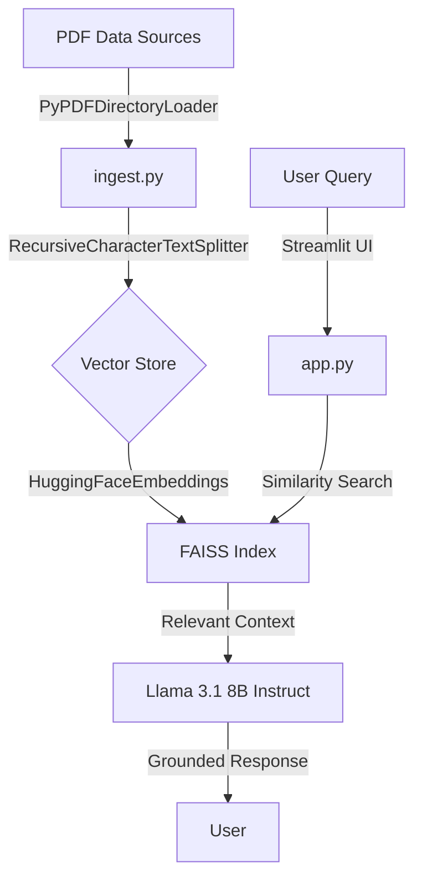
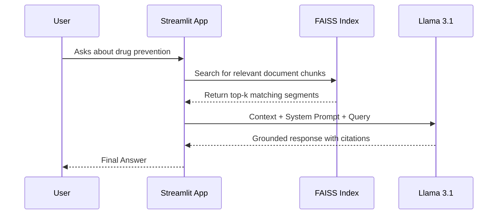

# Baseera (بصيرة) 🌙

**An AI-Powered Support Companion for Drug Awareness in Saudi Arabia.**

Baseera is a Retrieval-Augmented Generation (RAG) system built to provide empathetic, evidence-based guidance grounded in official Saudi Ministry of Health (MOH) and NCNC protocols. By utilizing open-source LLMs, this project demonstrates strong engineering practices in **local data privacy**, **open-source AI orchestration**, and **grounded response generation**.

---

## 🏗️ System Architecture

The following diagram illustrates the RAG lifecycle implemented in this project:



---

## 🛠️ Tech Stack

- **LLM:** Llama 3.1 8B Instruct (via Hugging Face Inference API)
- **Orchestration:** LangChain (Community & Partner Packages)
- **Vector Database:** FAISS (Local)
- **Embeddings:** `sentence-transformers/all-MiniLM-L6-v2`
- **UI:** Streamlit
- **Data Sources:** Official MOH & NCNC PDFs

---

## 🚀 Getting Started

### 1️⃣ Prerequisites

Create a `.env` file in the project root and add your Hugging Face token:

```env
HUGGINGFACEHUB_API_TOKEN=your_token_here
```

---

### 2️⃣ Installation

```bash
# Clone the repository
git clone https://github.com/your-username/baseera-ai.git
cd baseera-ai

# Create and activate virtual environment
python -m venv venv
source venv/Scripts/activate  # Windows
# source venv/bin/activate    # macOS/Linux

# Install dependencies
pip install -r requirements.txt
```

---

### 3️⃣ Data Ingestion (RAG Pipeline)

Before running the application, process the PDF documents inside the `data/` folder to generate the local FAISS vector store:

```bash
python ingest.py
```

This step:

- Loads all PDFs automatically
- Splits them into semantic chunks
- Embeds and stores them locally using FAISS

---

### 4️⃣ Run the Application

```bash
streamlit run app.py
```

---

## 🧠 Key Features

- **Grounded Citations:**
  Every response begins with _“Based on [Source]…”_ to ensure transparency and trust.

- **Automatic Directory Ingestion:**
  Any new PDF added to the `data/` folder is picked up during the next ingestion run.

- **System Prompt Engineering:**
  Specialized instructions ensure:
  - Empathetic, non-judgmental tone
  - Medical disclaimers
  - Cultural and regional sensitivity

- **Local Vector Store:**
  No external database required — all embeddings are stored locally.

---

## 📊 RAG Retrieval Logic



---

.

🛠️ Future Improvements & Roadmap
While Baseera is a functional RAG MVP, the following enhancements would elevate it to a production-grade system, particularly for the Saudi market:

1. Enhanced Arabic Linguistic Processing
   Semantic Chunking for Arabic: Transition from character-based splitting to Semantic Chunking using embeddings specifically trained on Arabic (e.g., AraBERT or Marbert) to ensure medical contexts are never severed mid-sentence.

Morphological Analysis: Integrating tools like CAMeL Tools for Arabic preprocessing (lemmatization and diacritic handling) to improve retrieval accuracy for different word forms.

2. Saudi Dialect Support (Ammiyah)
   Prompt Fine-Tuning: Enhancing the System Prompt to better interpret Saudi dialects (Najdi, Hejazi, etc.) while maintaining a response in formal Fusha, ensuring the AI understands local slang for substances without mimicking it unprofessionally.

3. Advanced RAG Techniques
   Hybrid Search: Combining BM25 keyword search with Vector search. This ensures that specific medical terms or Saudi law IDs (which can be "lost" in embeddings) are found with 100% precision.

Reranking Layer: Adding a Cross-Encoder reranker (like BGE-Reranker) to re-evaluate the top 10 results from FAISS, ensuring the most culturally and medically relevant chunk is fed to Llama 3.1.

4. System Evaluation (RAGAS)
   Automated Quality Metrics: Implementing the RAGAS framework to measure:

Faithfulness: Does the Arabic response actually come from the PDF?

Answer Relevance: Does it directly address the user's struggle?

Context Precision: Is the retrieved document snippet actually useful?

## ⚠️ Disclaimer

Baseera is an **educational and awareness tool**.
It does **not** replace professional medical, psychological, or legal advice.
For emergencies or medical decisions, always consult licensed professionals or official Saudi health authorities.

---

## 📌 License

This project is released for educational and research purposes.
