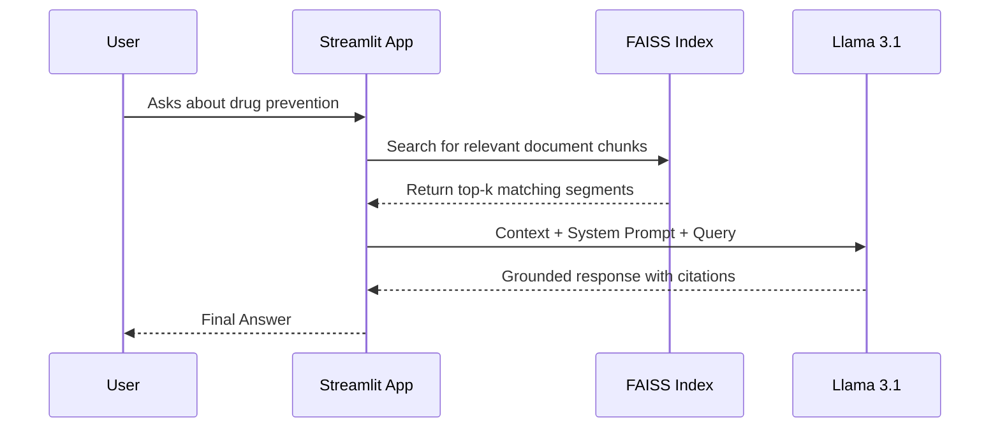

# Baseera (بصيرة) 🌙

**An AI-Powered Support Companion for Drug Awareness in Saudi Arabia.**

Baseera is a Retrieval-Augmented Generation (RAG) system built to provide empathetic, evidence-based guidance grounded in official Saudi Ministry of Health (MOH) and NCNC protocols. By utilizing open-source LLMs, this project demonstrates strong engineering practices in **local data privacy**, **open-source AI orchestration**, and **grounded response generation**.

---

## 🏗️ System Architecture

The following diagram illustrates the RAG lifecycle implemented in this project:

```mermaid
graph TD
    A[PDF Data Sources] -->|PyPDFDirectoryLoader| B[ingest.py]
    B -->|RecursiveCharacterTextSplitter| C{Vector Store}
    C -->|HuggingFaceEmbeddings| D[FAISS Index]

    E[User Query] -->|Streamlit UI| F[app.py]
    F -->|Similarity Search| D
    D -->|Relevant Context| G[Llama 3.1 8B Instruct]
    G -->|Grounded Response| H[User]
````

---

## 🛠️ Tech Stack

* **LLM:** Llama 3.1 8B Instruct (via Hugging Face Inference API)
* **Orchestration:** LangChain (Community & Partner Packages)
* **Vector Database:** FAISS (Local)
* **Embeddings:** `sentence-transformers/all-MiniLM-L6-v2`
* **UI:** Streamlit
* **Data Sources:** Official MOH & NCNC PDFs

---

## 🚀 Getting Started

### 1️⃣ Prerequisites

Create a `.env` file in the project root and add your Hugging Face token:

```env
HUGGINGFACEHUB_API_TOKEN=your_token_here
```

---

### 2️⃣ Installation

```bash
# Clone the repository
git clone https://github.com/your-username/baseera-ai.git
cd baseera-ai

# Create and activate virtual environment
python -m venv venv
source venv/Scripts/activate  # Windows
# source venv/bin/activate    # macOS/Linux

# Install dependencies
pip install -r requirements.txt
```

---

### 3️⃣ Data Ingestion (RAG Pipeline)

Before running the application, process the PDF documents inside the `data/` folder to generate the local FAISS vector store:

```bash
python ingest.py
```

This step:

* Loads all PDFs automatically
* Splits them into semantic chunks
* Embeds and stores them locally using FAISS

---

### 4️⃣ Run the Application

```bash
streamlit run app.py
```

---

## 🧠 Key Features

* **Grounded Citations:**
  Every response begins with *“Based on [Source]…”* to ensure transparency and trust.

* **Automatic Directory Ingestion:**
  Any new PDF added to the `data/` folder is picked up during the next ingestion run.

* **System Prompt Engineering:**
  Specialized instructions ensure:

  * Empathetic, non-judgmental tone
  * Medical disclaimers
  * Cultural and regional sensitivity

* **Local Vector Store:**
  No external database required — all embeddings are stored locally.

---

## 📊 RAG Retrieval Logic



---

## ⚠️ Disclaimer

Baseera is an **educational and awareness tool**.
It does **not** replace professional medical, psychological, or legal advice.
For emergencies or medical decisions, always consult licensed professionals or official Saudi health authorities.

---

## 📌 License

This project is released for educational and research purposes.
